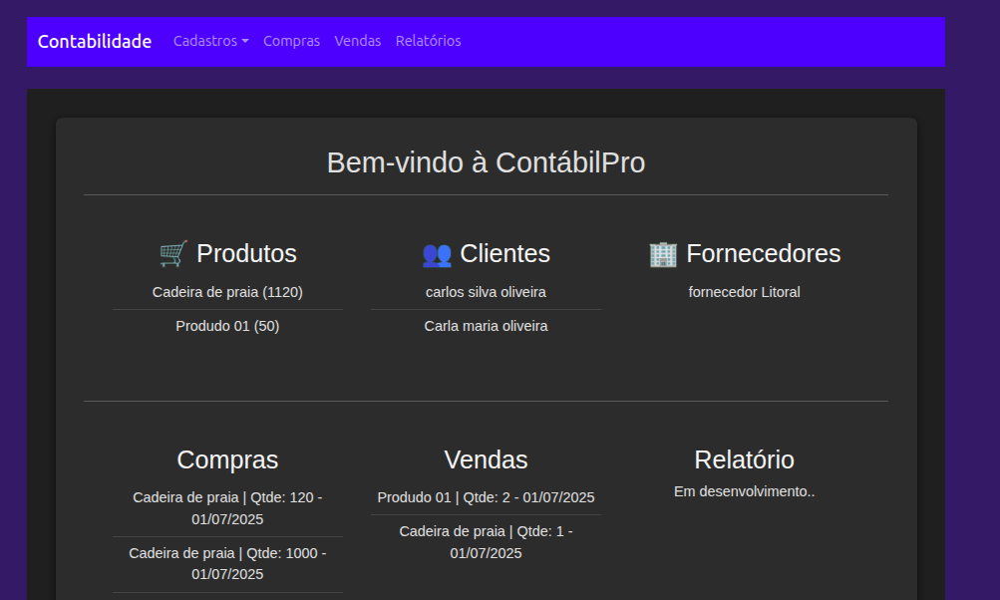

# 📊 Sistema Contábil - CRUD com Docker, Next.js e Prisma

Sistema completo de gerenciamento contábil com backend e frontend separados, integrados via Docker Compose.

---

## 🚀 Tecnologias Utilizadas

- 🐳 Docker + Docker Compose
- 🔧 Backend: **Next.js (API routes)** com **Prisma ORM**
- 🎨 Frontend: **Vite + React**
- 🛢️ Banco de Dados: **PostgreSQL**
- 🌐 Servidor Proxy: **NGINX**

---

## ⚠️ Pré-requisitos

Antes de rodar, certifique-se de que **nenhum serviço esteja utilizando a porta 80**:

```bash
sudo lsof -i :80

sudo systemctl stop apache2
# ou
sudo systemctl stop lighttpd


🛠️ Como iniciar o projeto? Na pasta raiz do projeto, execute:
docker-compose up -d --build

🔗 Acessos Rápidos
🧠 Backend (API + Prisma):
http://localhost:3000

💼 Frontend (Sistema Web):
http://localhost

## 💻 Tela do Sistema

